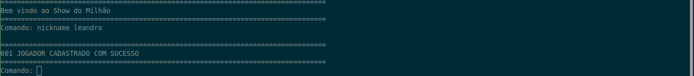
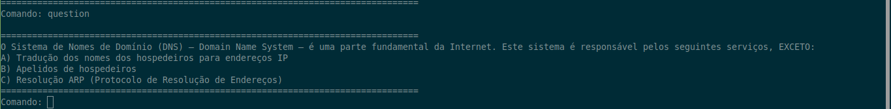
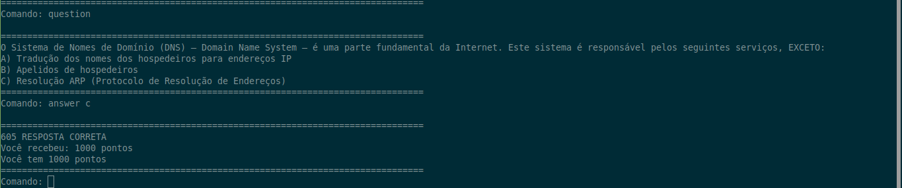
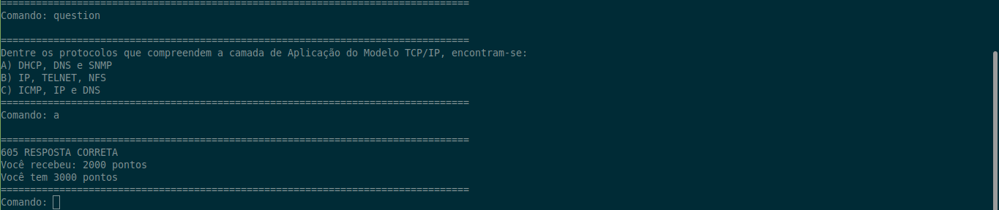
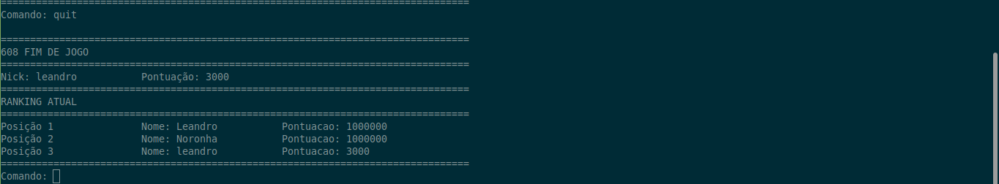

# million-show

**Aplicação**

O jogo tem como base as regras do jogo do milhão em sua primeira versão com algumas mudanças.

**Arquivos**

_database.py_

Esse arquivo tem armazenado o ranking e as questões que serão usadas no servidor.

_cliente.py_

Esse arquivo será usado pelos jogadores, sendo constituído apenas de um socket que se conecta ao servidor via tcp e mostra ao jogador as mensagens do servidor e envia suas respostas.

_servidor.py_

Esse arquivo será executado apenas uma vez, e abrirá uma conexão para os clientes se conectarem, nele está escrito todas as instruções e passo do jogo que será mostrado ao jogador, bem como um particionamento via threads para alocação simultânea de jogadores.

**Comandos**

_NICKNAME_ - Usado para definir seu nick.

_INFORMATION_ - Usado para mostrar as informações atuais.

_QUESTION_ - Usado para requisitar uma questão do sistema.

_SKIP_ - Usado para pular a questão atual.

_ANSWER_ - Usado para responder a questão atual.

_[A, B, C]_ - Uma forma mais simples para evitar repetições excessivas para respostas.

_HELP_ - Usado para solicitar um breve explicação sobre o jogo, listar e descrever os demais comandos.
 

_QUIT_ - Usado para encerrar o jogo e verificar sua pontuação.

**Regras**

O jogador terá três vidas, ou seja, poderá errar três questões no máximo, de forma que se suas vidas chegarem a zero o jogo encerrará.

O jogador terá a opção de pular a questão atual, e poderá usar no máximo três vezes, após isso o acesso a esse comando ficará indisponível.

Os comandos inválidos ou mal formados foram tratados e serão ignorados para que a jogabilidade não seja prejudicada.

A condição de vitória é conseguir passar as 15 questões e ao final ainda ter ao menos 1 vida, independente do uso de “skip”.

Em qualquer situação de final de jogo, será mostrado o ranking e a pontuação atingida pelo jogador.

Todo jogador conectado é salvo em uma lista e poderá jogar simultaneamente com os outros.

O ranking é atualizado sempre que um jogador encerra o jogo.
